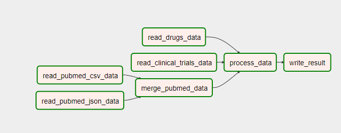

# Test Project

## I - Python et Data Engineering

Afin d'avoir **Airflow** en local, on utilise **Docker** pour mettre tout en place. Le fichier *docker-compose.yml* ainsi que le *dockerfile* sont inclus dans ce répertoire.

### 3. Data Pipeline

Le script *"dags/first_dag.py"* contient le code *Python* où on définit les différentes fonctions utilisées qui constituent le pipeline. Elles sont présentées ci-dessous :

* **read_data** : Lire les différents fichiers *(drugs.csv, pubmed_csv, clinical_trails.csv, pubmed.json)*
* **merge_pubmed_data** : Concaténer les données des deux fichiers *(pubmed.csv* et *pubmed.json)*
* **process_data** : Traitement pour générer le graphe de liaison en *JSON*
* **write_data** : Générer le fichier JSON (à trouver dans *"data/result.json"*)

On prévoit de définir le **DAG** comme ci-dessous, les règles de dépendances sont aussi définies à la fin du script.



Le JSON résultant suit le format choisi suivant: Il respecte le fait d'avoir les médicaments au centre du graphe de liaison, *i.e: on part de chaque médicament pour voir où il était mentionné dans chaque type de publication (pubmed, clinical_trials et journal)*

```
[
    {
        "drug_id": ...,
        "drug_name": ...,
        "mentioned_in": {
            "pubmed": [
                {
                    "article_id": ...,
                    "article_title": ...,
                    "date_mention": ...
                }, ....
            ],
            "journal": [
                {
                    "journal_title": ...,
                    "date_mention": ...
                }, ....
            ],
            "clinical_trials": [
                {
                    "article_id": ...,
                    "article_title": ...,
                    "date_mention": ...
                }, ....
            ]
        }
    },....
]
```

### 4. Traitement ad-hoc

Le script *"annexe.py"* contient la fonction *top_journal* qui retourne le journal qui mentionne le plus de médicaments différents.

### 6. Pour aller plus loin

J'ai essayé d'optimiser le plus possible mon code pour qu'il soit plus au moins optimal dans un environnement (Python et Airflow). Par contre, utiliser **Spark et GraphX** peut s'avérer une bonne idée. On peut bénéficier du traitement optimisé de **Spark** basé sur le concept du **MapReduce**, et du **GraphX** pour la création et la gestion des graphes. 

## II - SQL

### 2. Première partie du test
```
SELECT date, SUM(prod_price*prod_qty) AS ventes
FROM TRANSACTION
WHERE date BETWEEN '01/01/19' AND '31/12/19'
GROUP BY date
ORDER BY date;
```
### 3. Seconde partie du test
```
SELECT T.client_id, SUM(CASE P.product_type WHEN 'MEUBLE' THEN 1 ELSE 0 END) as ventes_meuble,
                    SUM(CASE P.product_type WHEN 'DECO' THEN 1 ELSE 0 END) as ventes_deco
FROM TRANSACTION AS T JOIN PRODUCT_NOMENCLATURE AS P ON T.prod_id = P.product_id
WHERE T.date BETWEEN '01/01/19' AND '31/12/19'
GROUP BY T.client_id;
```
